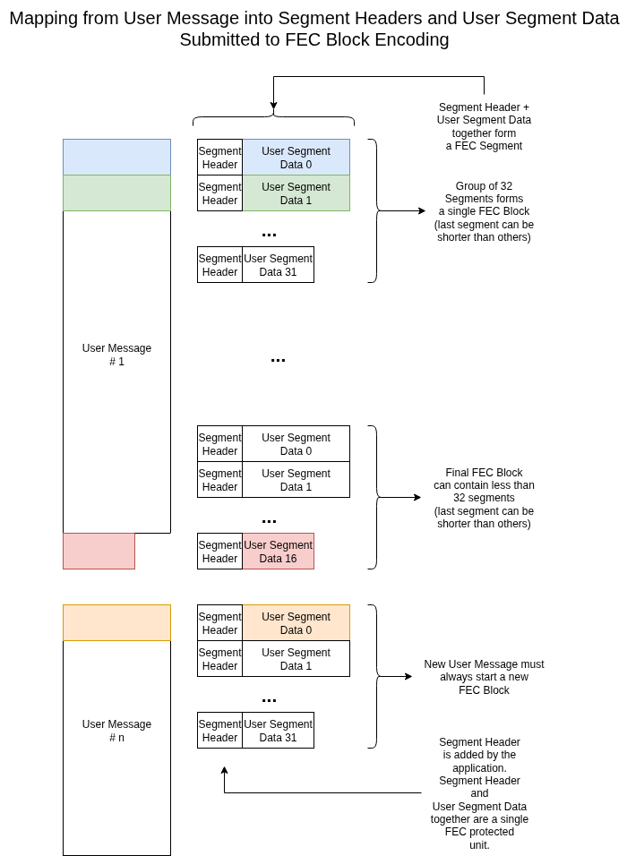
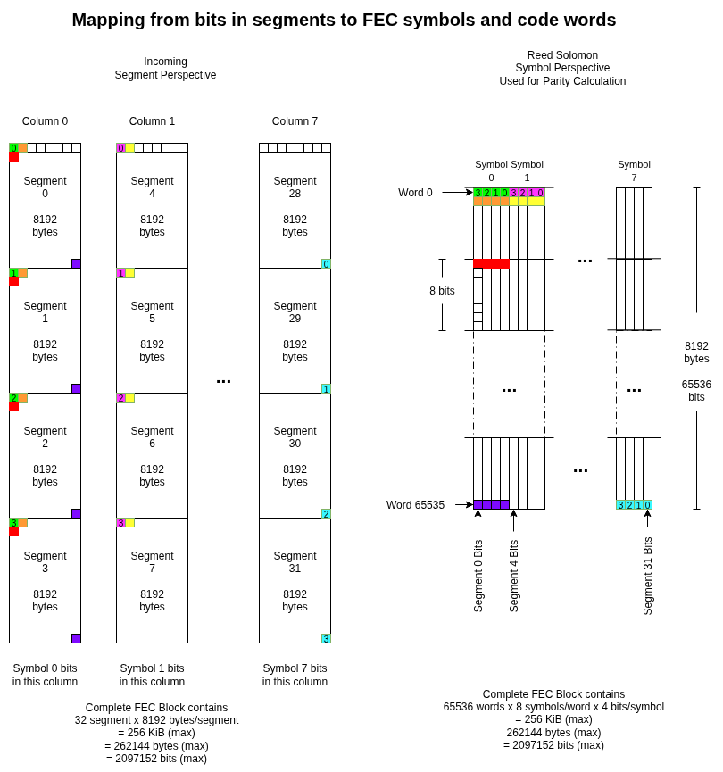

# Purpose and context of this document

This document describes the high level functionality provided in the Forward Error Correction block contained in this repository.

While many of the components that make up this design are generic and reusable on their own, this document will describe one reference way that they can be combined to protect groups of frames transmitted over a network.

# General Characteristics

The FEC implementation in this repository has the following properties.  Reading through this may help you decide if this matches up with your use case.
* Works with Datagram / Frame oriented network protocols
* Detects and corrects entire Datagram / Frame erasure events up to the limit of the FEC encoding capability
* Does NOT detect / correct bit errors / corruption in packet payload
* Operates independently on groups of up to 32 User Segments
  * Works on smaller groups but at an increased network overhead
  * Always adds 8 FEC Parity Segments to each group of 32 User Segments
* Does NOT directly handle implement any network receive or transmit functionality

# User Requirements

* The application produces User Messages that are contiguous sequences of bytes
  * User Messages should typically be larger than 32KB
  * The FEC implementation does work with smaller User Messages but the resulting network overhead may be prohibitive for your use case
* The application provides a pre-existing Segmentation method to split the User Messages into smaller segments which can each fit into a single Ethernet Frame
  * Typical maximum frame sizes are 1500 or 9000 bytes
  * Segments produced by the application from a single User Message are all of equal size (except the last segment)
  * Segments MUST NOT contain the network protocol headers used to deliver the packet over the network
  * Segments MUST contain sufficient metadata for the receive-side reassembly implementation to properly recover the original User Message
  * The receive-side reassembly implementation must handle interleaved reception of segments from multiple User Messages due to the possibility of packet reordering in the network
* The application passes the segments related to a single User Message as input to the FEC implementation in a contiguous sequence without interleaving segments from other User Messages.
* The application accepts an sequence of opaque FEC segments as output from the FEC implementation
  * The application should not make any assumptions about the format of the segments returned from the FEC implementation
    * The internal format and layout of the FEC segments will change in future updates
  * The FEC implementation will return more output segments than were provided as input
* The application uses a connectionless Datagram protocol for network transmission
  * The FEC implementation in this repository protects against erasure of entire network Datagrams, such as those used with UDP communication.  It is not applicable to data carried over protocols like TCP.
* The application wraps the FEC segments with appropriate network encapsulation for transmission on the network
  * This typically means prepending an Ethernet, IP and UDP header
  * This encapsulation may require other protocol headers specific to your transport path

# Definitions

`Application`: The FPGA top-level incorporating this FEC Implementation
`User Message`: A contiguous vector of bytes larger than one Ethernet frame size which is to be transmitted to a remote network endpoint
`User Segment`

# Transmit Path Example Walkthrough

This example will assume:
* The application has built a User Message which is 250000 bytes in length
* The application wants to send this entire User Message, protected with FEC to a remote application receiver at an IPv6 destination address, listening on a UDP socket
* The network interface maximum frame size is 1518 bytes
  * This includes an Ethernet header and associated FCS trailer
* The application will add Ethernet + IPv6 + UDP + Custom Load Balancer headers

Your application may have different parameters, but these assumptions give us something concrete to explore.



1. Application produces a `User Message` (`U_n`) of 250,000 bytes in length
2. Application calculates the fixed network header size
   * Ethernet: 14
   * IPv6: 40
   * UDP: 8
   * Custom Load Balancer: 16
   * Total: 14 + 40 + 8 + 16 = 78 bytes
3. Application calculates the fixed-size `Segment Header` size
   * Custom Segmentation: 20
   * This example header would include enough metadata to allow an application receiver to reassemble `User Message` (U_n) from an unordered collection of received segments.
   * Your `Segment Header` may be an entirely different size than this example.  Adjust accordingly.
4. Application makes note of per FEC Segment header size
   * On its way through the FEC implementation, Each User Segment has an Error Correction protocol header added
   * The Error Correction header is 16 bytes in length
5. Application calculates Segment Payload size after considering all encapsulation overhead
   * `Max User Segment Size` = `Max Frame Size` - `Network Headers Total Size` - `Segment Header Size` - `FEC Segment Header Size`
   * `Max User Segment Size` = 1518 - 78 - 20 - 16 = 1404
   * This represents the **maximum** number of bytes from `U_n` which can fit into a single Ethernet Frame on the network
   * `Selected Segment Size` = `Max User Segment Size`
     * The application is free to choose a Segment Size which is less than or equal to the computed `Max User Segment Size`.  The rest of this example will assume that you've chosen to use the max size.
6. Application calculates number of segments needed for `U_n`
   * `Number of Segments` = `ceil(User Message Size / Max User Segment Size)`
7. Application calculates number of `FEC Blocks` (groups of up to 32 segments) needed for `U_n`
   * Number of `FEC blocks` = `ceil(Number of Segments / 32)`
8. Application splits User Message `U_n` into User Segments
   * Result is a series of `User Segments` `UnS_0` through `UnS_m-1`
   * where m = Number of Segments
   * All `User Segments` `UnS_0`..`UnS_m-2` are of equal length `Selected User Segment Size`
   * `User Segment` `UnS_m-1` is of length `Last User Segment Size` <= `Selected User Segment Size`
9. Application prepends `Segment Header` to each `User Segment`
   * The application-defined Custom Segmentation Header should include sufficient metadata to allow the application's Rx reassembly implementation to identify all `User Segments` (`UnS_0`..`UnS_m-1`) and recombine them back into `U_n`.
   * Result is a series of `Tagged User Segments` `UnTS_0`..`UnTS_m-1`
10. Application submits `Tagged User Segments` into `FEC Blocks`
    * `while len(Tagged User Segments) > 0`
      * `NumUserSegmentsInFECBlock = min(32, len(Tagged User Segments))`
      * FEC Block Start
        * `NextProto` = `Segmentation Protocol ID`  # TODO DEFINE THIS
        * `DataID` = `Data Source Unique ID`   # TODO DEFINE THIS
		* `ApplicationCorrelationTag` = Opaque application-specific tag returned along with all output segments related to this FEC Block to allow the application to recover context if necessary prior to encapsulation
        * `InputSegmentsInFECBlock` = `NumUserSegmentsInFECBlock`
        * `InputSegmentSize` = `Custom Segmentation Header Size` + `Selected User Segment Size`
      * `for _ in range(0, NUMUserSegmentsInFECBlock)`
        * `s = take1(Tagged User Segments List)`
        * FEC Block Submit Tagged User Segment
          * `SegmentSize` = `length(s)`    # Either `TaggedUserSegmentSize` or `LastTaggedUserSegmentSize`
          * `SegmentData` = `s`
11. FEC Implementation accepts `Tagged User Segments` as input and produces `FEC Segments` as output after encoding
    * See below for internal details about how the FEC Implementation transforms the data to produce the output segements
	* `FEC Segment` Out
	  * `ApplicationCorrelationTag` = Opaque application-specific tag provided at the start of the related FEC Block to allow the application to recover context if necessary prior to encapsulation
	  * `SegmentSize` = # of bytes in the output FEC Segment
	  * `SegmentData` = `SegmentSize` bytes of opaque FEC encoded payload to be transmitted
	* **NOTE** Since the FEC Implementation generates additional segments carrying redundant parity data, **more segments will come out than you put in**.
12. Application consumes `FEC Segments` and encapsulates them for network transmission
    * Application builds complete Ethernet Frame by assembling
	  * Ethernet Header
	  * IPv6 Header
	  * UDP Header
	  * Custom Load Balancer Header
	  * `FEC Segment` Payload
	* **NOTE** that the assembled frame does not include the Custom Segmentation Header as a separate layer since that header is now encoded within the opaque `FEC Segment` Payload
	* Application (re)computes all relevant header Checksum and FCS fields
	* Application transmits the complete Ethernet Frame toward its destination

# FEC Implementation Internal Details

**=== WARNING ===**

The details provided here are informational only and may change in any way with new versions.  This section is **NOT** part of the API and users should not rely on specific details within this section.

**=== WARNING ===**



* FEC encoding
  * A FEC block is sized to be 8 symbol columns wide by up to 65536 rows deep.
    * Each symbol column is comprised of 4 packet segments, one packet segment per symbol bit-slice.
    * Each row represents a separate Reed-Solomon (RS) code word, each consisting of 8 symbols (each 4-bits wide).
    * Each FEC block thereby carries up to 65536 RS code words, each consisting of 8 symbols, each 4-bits wide, for a grand total of up to 524288 symbols (or 256 KiB).
    * Each RS code word is protected by 2 parity symbols, each 4-bits wide.  Parity symbols are calculated on-the-fly as packet segments are transmited.  Parity packet segments are then transmitted following the last packet segment of the FEC block.
  * Each group of 4 input E2SAR segments is transformed into 4 output packets within 1 column of the FEC block
    * The symbols produced from a group of 4 input E2SAR segments are all from separate FEC code words
      * input segments  0 to  3 represent symbol 0 from up to 65536 distinct FEC code words and are mapped to output packets 0-3 in column 0
      * input segments  4 to  7 represent symbol 1 from up to 65536 distinct FEC code words and are mapped to output packets 0-3 in column 1
      * input segments  8 to 11 represent symbol 2 from up to 65536 distinct FEC code words and are mapped to output packets 0-3 in column 2
      * input segments 12 to 15 represent symbol 3 from up to 65536 distinct FEC code words and are mapped to output packets 0-3 in column 3
      * input segments 16 to 19 represent symbol 4 from up to 65536 distinct FEC code words and are mapped to output packets 0-3 in column 4
      * input segments 20 to 23 represent symbol 5 from up to 65536 distinct FEC code words and are mapped to output packets 0-3 in column 5
      * input segments 24 to 27 represent symbol 6 from up to 65536 distinct FEC code words and are mapped to output packets 0-3 in column 6
      * input segments 28 to 32 represent symbol 7 from up to 65536 distinct FEC code words and are mapped to output packets 0-3 in column 7
    * **NOTE** Each bit of each symbol within a code word is transmitted in separate packets with no two bits of any symbol within a code word being carried in the same packet
  * Within each group of 4 input segments, the bits from each segment are mapped onto bits of the symbol in column N as follows
    * Segment 0: Each sequential bit of the segment represents bit 0 of symbol N for each of the up to 65536 FEC code words in the FEC block
    * Segment 1: Each sequential bit of the segment represents bit 1 of symbol N for each of the up to 65536 FEC code words in the FEC block
    * Segment 2: Each sequential bit of the segment represents bit 2 of symbol N for each of the up to 65536 FEC code words in the FEC block
    * Segment 3: Each sequential bit of the segment represents bit 3 of symbol N for each of the up to 65536 FEC code words in the FEC block
    * **NOTE** Each bit of each symbol within a code word is transmitted in separate packets with no two bits of any symbol within a code word being carried in the same packet
  * As each *output* packet is filled, it is transmitted
    * Constant Header || FEC Header || Segment
    * The packet data remains in the double buffer until the final FEC packets are generated (ie. after all 32 data packets have been transmitted)
    * This is required since all of the bits of symbols 0-7 are all required to compute the parity for each of the code words
	  * **Potential Optimization** As symbol 7 is filling in, we could start computing and sending parity packets
  * Parity packets are generated
    * Each FEC block produces 2 columns of parity (columns 8 and 9), each consisting of 4 parity packets (numbered 0-3)
      * Column 8 packets contain individual bits of parity symbol 0 for each of the up to 65536 FEC code words in the FEC block
        * Packet 0: bit 0 of parity symbol 0 for all FEC code words 0 - 65535
        * Packet 1: bit 1 of parity symbol 0 for all FEC code words 0 - 65535
        * Packet 2: bit 2 of parity symbol 0 for all FEC code words 0 - 65535
        * Packet 3: bit 3 of parity symbol 0 for all FEC code words 0 - 65535
      * Column 9 packets contain individual bits of parity symbol 1 for each of the up to 65536 FEC code words in the FEC block
        * Packet 0: bit 0 of parity symbol 1 for all FEC code words 0 - 65535
        * Packet 1: bit 1 of parity symbol 1 for all FEC code words 0 - 65535
        * Packet 2: bit 2 of parity symbol 1 for all FEC code words 0 - 65535
        * Packet 3: bit 3 of parity symbol 1 for all FEC code words 0 - 65535

Here's an updated EC frame format that I think supports all of the key ideas in v3 of our FEC structure:
```
 0                   1                   2                   3  
 0 1 2 3 4 5 6 7 8 9 0 1 2 3 4 5 6 7 8 9 0 1 2 3 4 5 6 7 8 9 0 1
+-+-+-+-+-+-+-+-+-+-+-+-+-+-+-+-+-+-+-+-+-+-+-+-+-+-+-+-+-+-+-+-+
|       E       |       C       |  Version (1)  |   Next Proto  |
+-+-+-+-+-+-+-+-+-+-+-+-+-+-+-+-+-+-+-+-+-+-+-+-+-+-+-+-+-+-+-+-+
|             DataID            |P|  EC Frame # |R|  Pad Frames |
+-+-+-+-+-+-+-+-+-+-+-+-+-+-+-+-+-+-+-+-+-+-+-+-+-+-+-+-+-+-+-+-+
|        EC Segment Size        |           Pad Bytes           |
+-+-+-+-+-+-+-+-+-+-+-+-+-+-+-+-+-+-+-+-+-+-+-+-+-+-+-+-+-+-+-+-+
|                          FEC Block #                          |
+-+-+-+-+-+-+-+-+-+-+-+-+-+-+-+-+-+-+-+-+-+-+-+-+-+-+-+-+-+-+-+-+
```
* Magic: "EC"
* Version: 1
  * This exact header format (ie. fields and their position and meaning)
  * Also means the exact set of FEC parameters (polynomial, how segment bits map to symbols/code words, etc)
  * We have to change this version to change any of the attributes about how FEC works
* Next Proto
  * Tells a parser what header follows
  * Useful for wireshark decoders
  * Useful for future HW SAR
  * Not used by FEC block at all
* DataID
  * Unique # for a sender/DAQ within a given experiment
  * Used to group/scope EC packets by sender
* P: 0 means this is a DATA frame, 1 means this is a PARITY frame
* EC Frame #
  * When P = 0, which of the 32 data frames is this within the FEC block
  * When P = 1, which of the 8 parity frames is this within the FEC block
  * Frames are numbered left-to-right, top-to-bottom within the FEC block
    * Column 0, Segment 0 -> P 0 / EC Frame 0
    * Column 1, Segment 1 -> P 0 / EC Frame 1
    * ...
    * Column 7, Segment 3 -> P 1 / EC Frame 31
    * Column 8, Segment 0 -> P 1 / EC Frame 0
    * Column 8, Segment 1 -> P 1 / EC Frame 1
    * ...
    * Column 9, Segment 3 -> P 1 / EC Frame 7
* Pad Frames:
  * # of DATA frames are completely elided within this FEC block
  * The elided frames must be a contiguous block of the highest numbered EC frames.  No holes, just a set of elided frames at the tail.
* EC Segment Size
  * This is the fixed size (in BYTES) of the non-last segments in this FEC block, provided to the encoder as the new FEC block was started
  * Repeated in every transmitted data or parity frame
* Pad Bytes
  * # of bytes of padding (zeros) elided from the tail of this specific frame 
  * Only allowed to be non-zero for the last data segment within any FEC block
  * (this field is a bit redundant given that we have the EC Segment Size and presumably also the actual length of the frame in hand -- might be able to drop this field?)
* FEC Block #
  * Incrementing number (per FEC encoder) which binds all of the related EC frames within a FEC block together
  * Encoder should increment this once at the start of each FEC block and hold it constant across all packets within a given FEC block
  * Allowed to wrap


